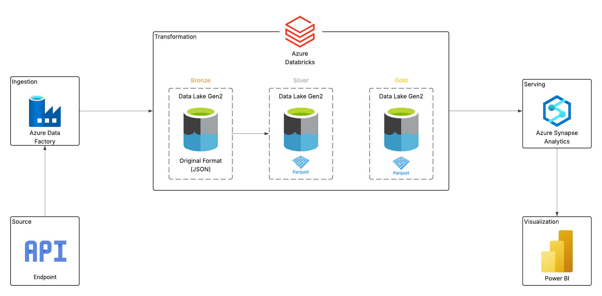

# 🌍 Earthquake API Data Engineering Project

This project demonstrates a modern data engineering pipeline built on Microsoft Azure for ingesting, transforming, and visualizing real-time Earthquake data from a public API. It showcases a robust and scalable architecture suitable for analytics and reporting, using best practices in data lakehouse design (Bronze-Silver-Gold model) and modern cloud-native tools.

## Architecture


## 🚀 Project Summary

The purpose of this project is to design and implement an end-to-end data pipeline that:
- Ingests raw Earthquake data from a public API.
- Stores the data in a structured multi-layered Data Lake (Bronze, Silver, Gold).
- Transforms raw JSON data into optimized Parquet files using Azure Databricks.
- Serves the cleaned and curated data for reporting via Azure Synapse Analytics.
- Visualizes insights using Power BI dashboards.

## 🛠️ Technologies & Tools Used

| Layer        | Tool/Service             | Description |
|--------------|--------------------------|-------------|
| Source       | 🌐 Public Earthquake API | Real-time earthquake data source |
| Ingestion    | 🏭 Azure Data Factory     | Pipelines to extract and load raw data |
| Storage      | 🪵 Azure Data Lake Gen2   | Scalable lake storage with Bronze-Silver-Gold zones |
| Processing   | 🔥 Azure Databricks       | Data transformation and processing using PySpark |
| Serving      | 📊 Azure Synapse Analytics| Query and serve data for reporting |
| Visualization| 📈 Power BI               | Interactive dashboards and reports |

## 🧱 Data Lakehouse Architecture

This project uses the **medallion architecture**:
- **Bronze Layer:** Stores raw JSON data from the API (immutable).
- **Silver Layer:** Cleansed and schema-aligned data stored in Parquet format.
- **Gold Layer:** Aggregated and business-ready datasets used for reporting.

## 📊 Power BI Dashboard

The final output is a Power BI dashboard that provides:
- Latest earthquake activity by region
- Magnitude and depth distributions
- Time-based trends and historical analysis

## 📁 Project Structure

```bash
.
├── Databricks Notebooks/        # Azure Databricks notebooks
├── Data Factory Pipelines/      # ADF pipeline notebooks
├── Dashboard/                   # Power BI .pbix files and screenshots
├── README.md                    # Project documentation (this file)
```

## 🧠 Key Learning Outcomes

- Building a cloud-native data pipeline using Azure services.
- Implementing a structured medallion architecture for data lakes.
- Automating ingestion and transformation of semi-structured API data.
- Creating real-time dashboards from raw API data using modern BI tools.

## 📌 Future Enhancements

- Automate alerting system for large earthquakes using Azure Logic Apps.
- Incorporate historical earthquake datasets for advanced analytics.
- Implement CI/CD for pipeline deployment and Databricks notebooks.

---

- [📊 View Power BI Dashboard](#)
